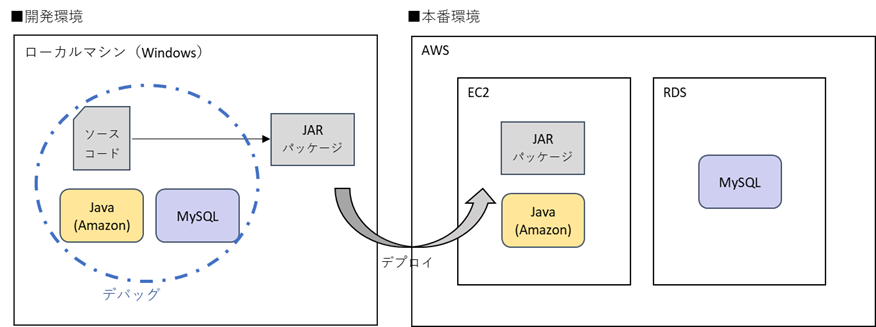

# EC2 + RDS サンプルアプリ

> DB 利用を前提とした、AWS を使用した本番環境構築・デプロイに関する Qiita 記事用アプリケーション

## 📝 関連記事

- [【EC2 + RDS】Spring Boot/MySQL アプリの本番環境を構築 [前編] - 開発環境でのアプリ・DB 構築まで](https://qiita.com/okayu__11/items/ac3f678bdaf771940762)
- [【EC2 + RDS】Spring Boot/MySQL アプリの本番環境を構築 [後編] - AWS インフラ構築とデプロイ](https://qiita.com/okayu__11/items/1a0f60ffa263ec39f960)

## 🚀 クイックスタート

### 1. リポジトリのクローン

```bash
git clone https://github.com/y1221/qiita-spring-ec2-rds.git
cd your-repo
```

### 2. データベースの準備

```bash
# MySQLにログイン
mysql -u <ルートユーザ名> -p

# データベースを作成
CREATE DATABASE <任意のデータベース名>;

# ユーザを作成
CREATE USER '<任意のユーザ名>'@'localhost' IDENTIFIED BY '<任意のパスワード>';

# ユーザに権限を付与
GRANT ALL ON <任意のデータベース名>.* TO '<任意のユーザ名>'@'localhost';
```

### 3. 環境変数の設定

```bash
# .env ファイルを作成
cp .env.example .env

# 必要な環境変数を設定
nano .env
```

#### 環境変数の例

```env
# データベース設定
DEV_DB_URL=jdbc:mysql://localhost:3306/<任意のデータベース名>
DEV_DB_USERNAME=<任意のユーザ名>
DEV_DB_PASSWORD=<任意のパスワード>
```

### 4. アプリケーションの起動

```bash
# ファイルの実行権限付与
chmod u+x mvnw

# 実行
./mvnw spring-boot:run
```

### 5. アクセス

http://localhost:8080/users

## 🛠️ 技術スタック

### バックエンド

- **言語**: Java 21
- **フレームワーク**: Spring Boot 3.5.3
- **データアクセス**: Spring Data JPA
- **テンプレートエンジン**: Thymeleaf
- **データベース**: MySQL 8.4.5

### 開発ツール

- **ビルドツール**: Maven 3.9.10
- **データベースマイグレーション**: Flyway

### インフラ

- **クラウド**: AWS
- **CI/CD**: GitHub Actions

## 🏗️ システム構成

### 環境全体図



### AWS インフラ構成


## ⚙️ 前提条件

### 必要なソフトウェア

- **JDK**: 21 以上（開発時使用: JDK 21）
- **MySQL**: 8.0 以上（開発時使用: MySQL 8.4.5）

### 検証済み環境

- Ubuntu 24.04 LTS
- Windows 11 Home

## 👨‍💻 作者

**おかゆ**


- GitHub: [@y1221](https://github.com/y1221)
- Qiita: [@okayu\_\_11](https://qiita.com/okayu__11)
- X: [@okayu\_\_11](https://twitter.com/okayu__11)
